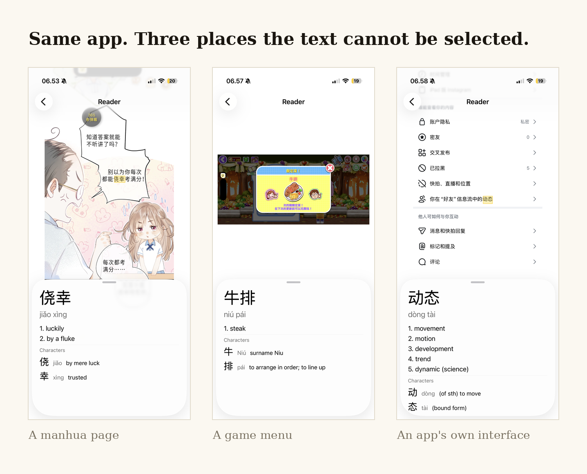
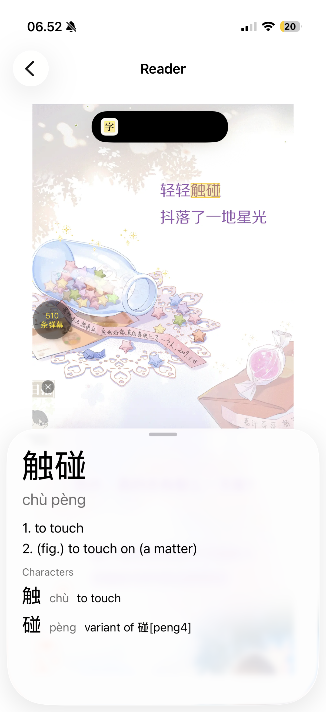
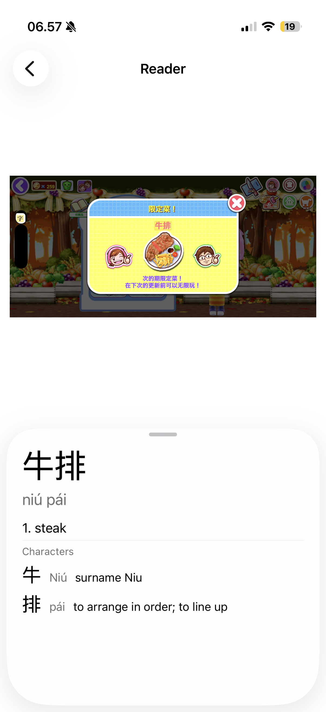
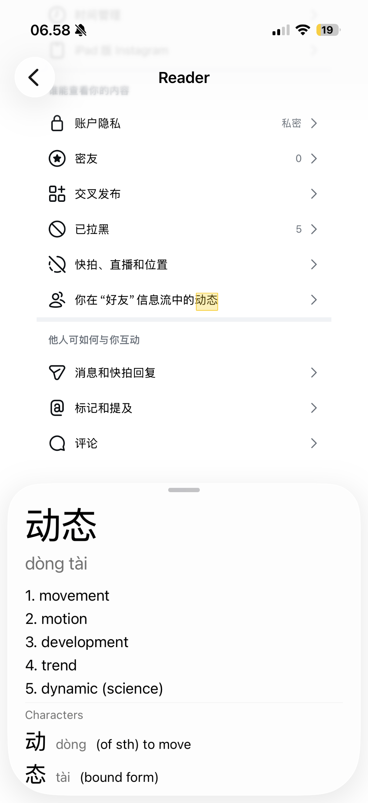

<p align="center">
  
</p>

<p align="center">
  <b>Tap any Chinese character in a screenshot. Get the word, its pinyin and its meaning. Keep reading.</b><br>
  An offline iOS reading companion for the Chinese you can see but cannot select.
</p>

<p align="center">
  Swift · UIKit · Vision · NaturalLanguage · App Intents · SQLite · Swift Testing
</p>

---

<!-- DEMO VIDEO PLACEHOLDER
     GitHub only plays a video in a README if it is uploaded through the web editor.
     1. Open this README on github.com and click the pencil (Edit).
     2. Drag docs/media/glozi-demo-wide.mp4 (from your computer) into the editor, right here.
     3. GitHub inserts a https://github.com/user-attachments/... link. Commit.
     Then delete this comment. -->



## Why it exists

Manga bubbles, game menus, photos of packaging, even your own phone's interface once it is set to Mandarin: most Chinese on a phone cannot be selected, so popup dictionaries cannot reach it. The usual fallback is to translate the whole thing, which pulls you out of the language.

Glozi is the third option. Screenshot the page, tap the one word that stopped you, carry on reading. **It never offers a full translation, on purpose.**

## Features

- **Tap-to-word lookup** on any image, at any zoom level. The tapped word is highlighted and the dictionary card never covers it.
- **Dictionary card** as a native sheet: pinyin with tone marks, meanings, and a per-character breakdown.
- **Fully offline.** CC-CEDICT (about 125,000 entries) is converted to SQLite and bundled in the app.
- **Action Button entry point** through an App Intent and a Shortcut: press the button, the current screen is captured and opens in the reader.
- **Photos import** with `PHPickerViewController`, so the app never asks for photo library access.
- **Empty, error and "nothing recognised" states**, plus an About screen with the CC BY-SA 4.0 credit.

| Manhua | Game menu | App interface |
|---|---|---|
|  |  |  |

## How it works

```
Screenshot ──> Vision OCR (.accurate, zh-Hans / zh-Hant)
                 │  per-character bounding boxes, cached per image
Tap ──> convert tap to image pixels (any zoom) ──> hit-test character box
                 │
          NLTokenizer finds the word around that character
                 │
          shrink to the longest CC-CEDICT headword that still covers the tap
                 │
          SQLite lookup ──> dictionary card
```

**Architecture.** Programmatic UIKit, no storyboards. Recognition sits behind a `TextRecognizing` protocol so the reader can be tested without Vision. All SQLite C API calls are confined to `DictionaryDatabase.swift`. `WordLookup` turns a tapped position into a dictionary answer and has no UIKit dependency.

## Engineering decisions, tested rather than assumed

Two short experiments ("spikes") ran before the core code was written. Both overturned an assumption. Full write-up with the raw numbers: **[docs/platform-findings.md](docs/platform-findings.md)**.

1. **Apple's `NLTokenizer` segments Chinese correctly.** It got all five hard test sentences right, including 上海市长江大桥, where greedy longest-match (the approach used by popular reader apps) gets it wrong. It became the primary word-boundary method, and the hand-written matching rule was dropped.
2. **Vision's per-character bounding boxes work for Chinese at `.accurate`.** Apple documents them as word-level only, but Chinese has no spaces, so every character is its own "word". `.fast` returned zero results on two of three test images, so it was removed rather than kept as a fallback.
3. **Pinch zoom is a correctness requirement, not a nice-to-have.** Interface text measured 24 to 36 px per character, below Apple's 44 pt minimum touch target.
4. **Why UIKit rather than SwiftUI.** The whole app is one zoomable image where every tap must map back to one exact character. `UIScrollView` gives that control directly.

## Run it

Requirements: Xcode 26, iOS 26.5 or later.

```bash
git clone https://github.com/jesslyntrixie/glozi.git
open glozi/glozi/glozi.xcodeproj
```

Pick an iPhone simulator and run. A sample page is bundled, so no setup is needed. To run on a device, set your own team under *Signing & Capabilities*.

Tests: `Cmd+U` (Swift Testing: dictionary lookup, word boundaries, text recognition).

Rebuild the dictionary database (optional):

```bash
python3 tools/build_dictionary.py   # data/cedict_ts.u8 -> data/glozi.sqlite
```

## Status and next steps

Built in two weeks as an individual challenge at the Apple Developer Academy (Sep 2026). Working end to end on device.

Next: saving words and a personal library, vertical text (common in manga, not yet tested), marking low-confidence recognition, and a share extension.

## Credits

- Dictionary: [CC-CEDICT](https://cc-cedict.org), licensed CC BY-SA 4.0.
- Built by [Jesslyn Trixie Edvilie](https://www.linkedin.com/in/jesslyn-trixie-edvilie/).
